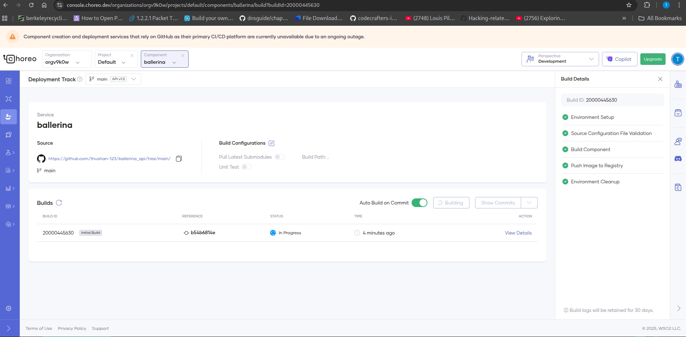
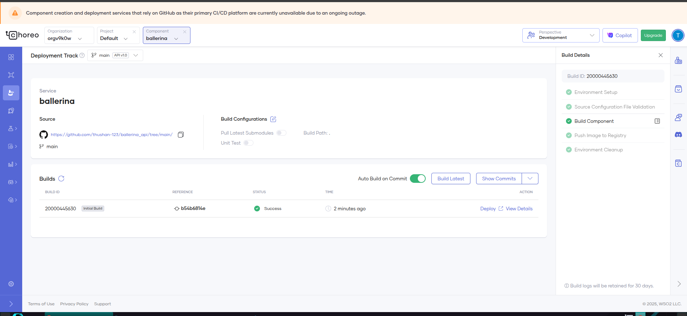
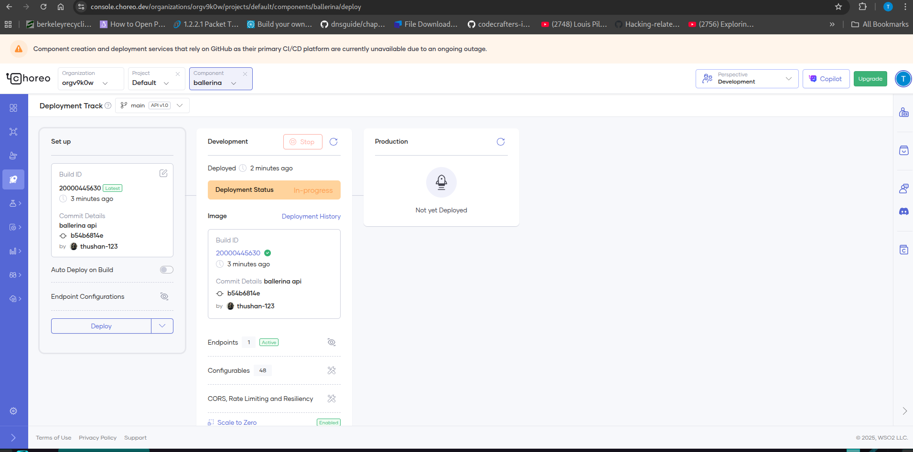
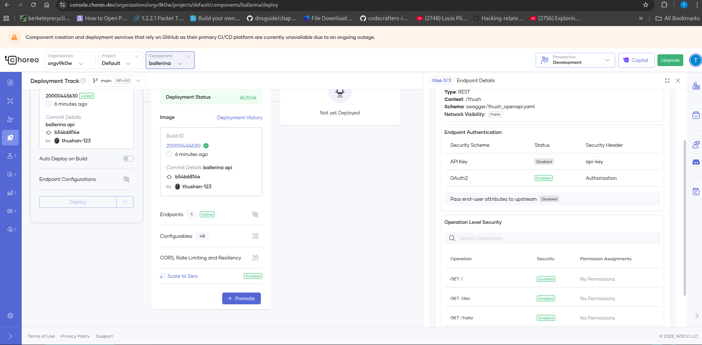
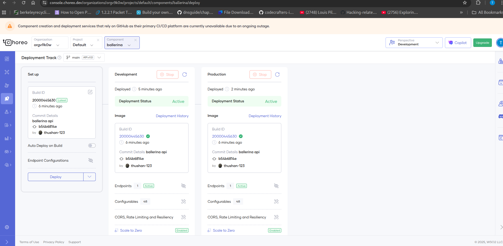
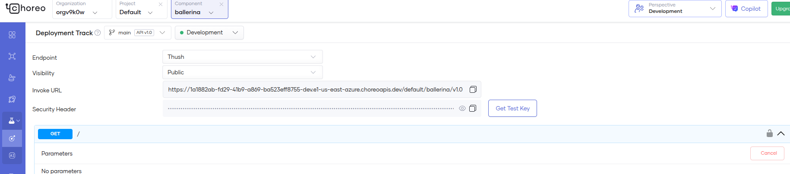
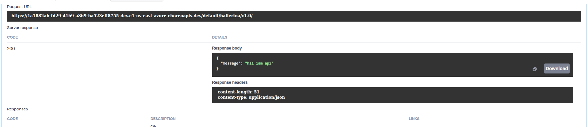

# wso2 choreo integration ballerina simple api 

## screenshots
Choreo 

build balllrina api -> deploy manage api

## connect github

## Choreo builds & deploys

## test ballerina api endpoint
